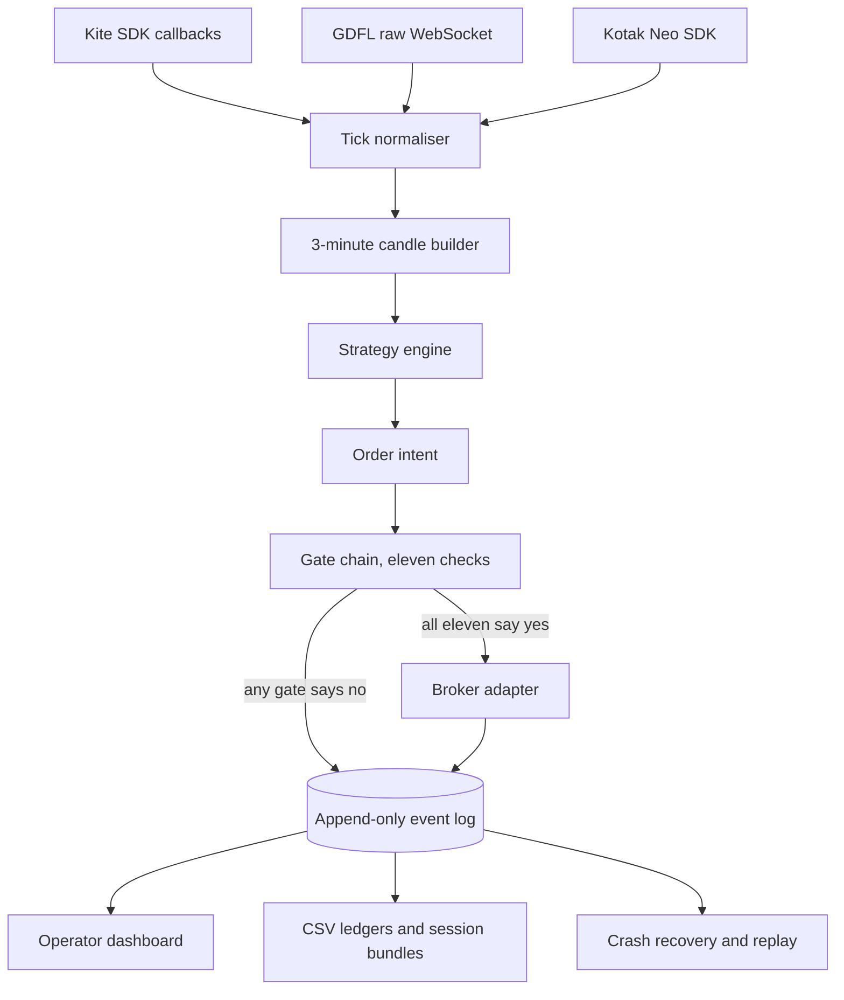
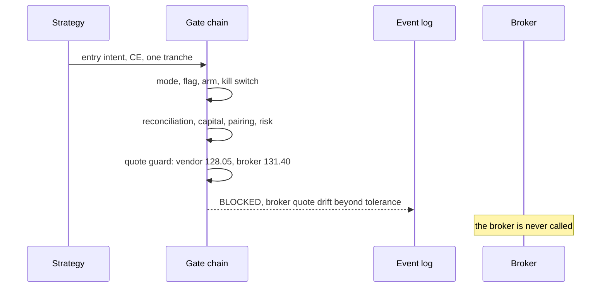

# refuses-to-trade

*A NIFTY options execution system wired to a live brokerage account, engineered so that it does not place orders.*

<p align="center"></p>

The order-placement call in this system has never executed against the broker. Not once. Eleven independent checks sit between the strategy and that call, every one of them defaults to no, and each refusal is written to an append-only log with the reason attached.

| Figure | What it counts | How obtained |
|---|---|---|
| 76,873 | lines of Python, TypeScript, TSX and CSS under version control | `git ls-files` filtered by extension, piped to `wc -l`, 2026-09-01 |
| 609 | backend tests | `pytest --collect-only -q`, same commit |
| 68 | frontend tests | vitest cases in `dashboard/src` |
| 11 | independent fail-closed gates before an order leaves the process | one per module, listed in [docs/SAFETY.md](docs/SAFETY.md) |
| 3 | market-data vendors behind one interface | Zerodha Kite, Global Financial Datafeeds, Kotak Neo |
| 55 | versioned runtime event types, validated on write and on read | `KNOWN_RUNTIME_EVENTS` in the event contract module |
| 1,090,406 | events recorded across 80 runner sessions, 2026-03-29 to 2026-05-22 | line count over the session logs on this machine, 258 MB |
| 349 | orders the strategy built and handed to the gate chain | `execution_intent` events in those logs |
| 0 | orders that reached the broker | every session ran with `live_orders_enabled=false` |

> [!IMPORTANT]
> The source is private. It operates a real brokerage account, and the entry logic it encodes belongs to the person whose account it trades. This repository holds the engineering: architecture, the safety design, the decisions and the ones I reversed, post-mortems from live sessions, and three clean-room excerpts written for this write-up. What a reviewer can check here is the reasoning and the shape of the system. What I can offer beyond it is a screen-share walk-through of the real repository.

## The problem is a human who cannot press four buttons at once

My brother trades NIFTY index options intraday. His method is discretionary in one respect and mechanical in every other: he decides where a single price level sits on the futures chart each morning, and everything after that follows rules. The rules are the part a person executes badly. They require reacting inside a second, then managing four separate position tranches with four different profit targets, for six hours, without drifting.

So the division of labour was decided before any code: the human draws the level, the machine does the rest. The human stays in the loop for the judgment a machine cannot make, and stays present for every session, because the system has no authority to act alone.

That constraint produced the shape of the codebase. Roughly half of it decides what to do. The other half decides whether it is allowed to.

**Goals.** Encode the method precisely. Make every decision reconstructable after the fact. Fail closed on anything unknown. Keep one human able to stop it inside a second.

**Non-goals.** No unattended operation. No automatic flattening of a position without a person watching. No strategy search, no parameter optimisation, no backtest-driven claims. No second account, no distribution to anyone else.

## Architecture: one log, many readers

Three vendors speak three protocols. A callback SDK, raw JSON over a WebSocket, and a vendor SDK that misreports its own socket state. They normalise into one frozen tick type, and from there the system is a pipeline whose only durable artifact is an append-only JSONL log.



There is no database. The log is the record, and the dashboard, the ledgers, the crash-recovery seed, the offline replay engine and the drill validator are all folds over it. A crashed session resumes by replaying its own log. A dashboard bug is reproducible from a file someone mails me.

Two invariants hold, and both are absences. Nothing downstream of the gate chain can construct an order; the broker adapter accepts an intent that the chain has already approved and has no path to build one itself. And no reader writes: the dashboard's controls land in separate operator-control files that the runner polls, so a UI defect cannot corrupt trading state.

More in [docs/ARCHITECTURE.md](docs/ARCHITECTURE.md).

## Every gate defaults to no

The gates are polled the way a launch team is polled. Each one answers, one no-go holds, and silence is not a yes: a gate that throws while deciding is recorded as a refusal.

<p align="center"></p>

| Gate | Refuses when |
|---|---|
| Execution mode | the branch is not set to live |
| Environment flag | the process environment does not enable live orders |
| Operator arm | the operator has not armed orders from the dashboard |
| Kill switch | the switch is set, in this session or carried from the last |
| Startup reconciliation | the broker holds orders or positions this process cannot explain |
| Capital floor | available margin is below the configured minimum, or cannot be parsed |
| Provider and broker pairing | the data source and the execution broker are not an approved combination |
| Risk gate | a loss limit, a margin rejection, or an unmapped partial fill has latched |
| Broker quote guard | the vendor price and the broker price disagree beyond tolerance, or the broker quote is missing |
| Market-data health | a stream stalled, a gap opened, or the queue overflowed |
| Contract compatibility | the selected instrument does not map to a tradeable broker symbol, or maps ambiguously |

The last one is worth a sentence. Vendor A names a contract one way and the broker names it another, so before an order can exist the system proves the mapping is unique and the lot sizes agree. When it cannot, it refuses. A mapping bug in this design makes the system stop trading, never trade the wrong instrument.

The tolerance is asymmetric on purpose. Quote drift, stream health and a missing broker quote block entries and never block an exit. You may always be allowed to leave a position you already hold.



Per-gate contracts and the test that pins each one: [docs/SAFETY.md](docs/SAFETY.md).

## Decisions, and the two I reversed

| Decision | Alternatives rejected | Why | Cost accepted |
|---|---|---|---|
| Append-only JSONL as the system of record | Postgres, SQLite | Audit trail, replay and crash recovery fall out for free; every consumer is a fold | No queries. Analysis means writing a reader |
| Limit orders everywhere, including exits | Market orders on emergency paths | A market order in an illiquid option strike is an unbounded price | An exit can fail to fill. The control is a present human |
| Ambiguity as a first-class order state | Treat a timeout as success or as failure | Retrying places two orders; not retrying strands a position | A third status to handle in every consumer |
| Encode trade identity in the broker's own tag field | A local order journal | Crash recovery works from the broker's data with no local state to corrupt | Twenty characters to encode into, which forced the bitmask |
| Human draws the level | Detect it from prior-day structure | It is the one judgment worth keeping human, and it makes unattended operation impossible by construction | The system cannot start without a person |
| Reversed: a four-package architecture refactor | Shipping capability on the flat layout | I planned the packages, then shipped features instead, and wrote down that I had not followed my own plan | The two largest modules are past 1,500 lines and want splitting |
| Reversed: promoting the third vendor after two clean drills | Keeping it diagnostic-only | Two consecutive clean runs were not enough while a warning I could not explain was still firing | A vendor integration that works sits unused |

The last row is the one I would defend hardest. A tolerated warning whose cause you cannot explain is a bug you have agreed to ship.

More in [docs/DECISIONS.md](docs/DECISIONS.md).

## What the logs actually show

<p align="center"></p>

Sessions ran against live market data in observe and paper modes, where fills are synthesised locally and no broker call is made. That distinction matters for reading the numbers above: the 349 intents are real decisions on real prices, and the fills recorded against them are simulated.

Here is a tick the system threw away, quoted from a session log:

```json
{"event": "ignored_tick", "reason": "OUT_OF_TRADING_DAY", "tick_date": "2026-03-30",
 "trading_day": "2026-03-31", "tradingsymbol": "NIFTY26APRFUT", "last_price": 22454.6}
```

And a stream-health event, which arms a block on new entries while leaving exits alone:

```json
{"event": "kotak_stream_health", "health_code": "KOTAK_TICK_GAP", "gap_seconds": 10.034,
 "message": "Kotak realtime gap was 10.0s.", "stream_role": "primary"}
```

Feed timing is measured in two places, and the split is the useful part. Between frames arriving off the vendor socket, p50 was 0.242 s and p95 1.583 s. Between a frame landing in the queue and the strategy thread picking it up, p50 was 0.000 s and p95 0.002 s. Three orders of magnitude apart, which answers "is it them or us" without an argument.

## Three sessions that changed the code

**A vendor socket that reported success and delivered nothing.** The runner starts before the open, subscribes, and every call returns success. The market opens and no ticks arrive. The vendor SDK deduplicates subscriptions per socket object, so resubscribing was a silent no-op, and at shutdown the socket had already been closed on the far side. Detection took a full session because every health check passed: authenticated, subscribed, no errors. The fix throws the socket away at the moment normal-market data becomes expected and rebuilds it, and lifecycle callbacks now record open, close and error events that the SDK was swallowing. Where I got lucky: it happened in observe mode.

**A cold feed and a strike nobody would buy.** On one session the option chain arrived sparse and the selector picked a strike thousands of points away from the money at a price of zero. Nothing rejected it, because nothing checked. Three changes followed: instrument caches expire with the trading date, non-positive prices are refused at the quote boundary rather than downstream, and an expiry whose inferred strike spacing is implausible is skipped entirely. The test that pins it feeds the selector a sparse chain and asserts a refusal.

**A backwards timestamp that killed a session, correctly.** Candle bucketing and the running-average accumulator both require non-decreasing timestamps, and both raise rather than warn. When a vendor's merged partial payloads began surfacing an older exchange timestamp, that assertion ended a live session. Relaxing the check was the tempting fix and the wrong one; a silently accepted backwards tick corrupts the candle the entry signal is computed from, which is a wrong trade instead of a stopped session. The tick is now dropped at the vendor boundary and counted. The count is why that vendor is still not trusted.

Longer form, with timelines: [docs/POSTMORTEMS.md](docs/POSTMORTEMS.md).

## Three patterns, written fresh for this repository

The excerpts in [`excerpts/`](excerpts/) are re-implementations of ideas from the private system, not extracts of it. Each is self-contained, runs on Python 3.11 with no dependencies, and uses synthetic data.

<details>
<summary>A twenty-character broker tag that decodes back into a trade identity</summary>

The broker gives each order one free-text field, capped at twenty characters. That field is the only channel through which the process can send a message to its own future self across a crash. Packing the trading day, a cycle id, an action code, the side, a four-bit tranche mask and a content hash into it means restart recovery reads the broker's own order book and rebuilds what each open order belongs to, with no local state. The tranche mask is the part that makes it work: without it you know a position exists but not which tranche, and therefore not its target.

Run it: `python excerpts/order_tag.py`
</details>

<details>
<summary>Gate composition where an exception is a refusal</summary>

Each gate returns either nothing or a reason. A gate that raises is recorded as a refusal with the exception text as the reason, so a broken check cannot become a silent pass. The verdict carries the list of blockers, because a refusal without a reason trains an operator to flip switches until it works. Entries and exits are evaluated against different gate sets.

Run it: `python excerpts/fail_closed_gates.py`
</details>

<details>
<summary>Reading an append-only log that another process is still writing</summary>

The reader consumes only newline-terminated lines and remembers the byte offset of the last complete one, so a half-written final line is never parsed and is picked up whole on the next poll. Without this the dashboard throws a JSON error every few seconds and the operator learns to ignore their own logs. The demo writes a torn line, reads, then completes it and reads again.

Run it: `python excerpts/event_log_projection.py`
</details>

## What it cannot do, and what has to be true before it trades

<p align="center"></p>

The gates cannot protect against a fill the broker reports late, or against an exit order that does not fill because the strike has no liquidity. The control for both is a person watching, which is why the system has no unattended mode. It runs on one machine, with one operator, against vendors whose failures I can detect but not prevent. Two modules are past 1,500 lines and want splitting, and I have written that down rather than pretending otherwise.

One open defect is worth stating plainly, because it sits on the most important path. The broker began requiring a protection parameter on market orders in April 2026, and orders that omit it are rejected. The system never sends it, and the only market order it can produce is the operator's emergency exit. Until that is fixed and proven against the live API, the broker's own mobile app is the real emergency exit, and that instruction is written at the top of the go-live runbook rather than left in someone's head.

Before the first real order, all of this has to be true: a static IP registered with the broker and verified through the same transport the orders use, the market-order parameter fixed and proven, a fixed-price order placed far from the market and cancelled to prove the plumbing, one lot bought and sold to prove the fill path, the emergency exit proven, and the operator at the screen. That list is the exit condition. Until every line of it is checked, zero remains the correct number of orders.

## What is private and what you can verify

Private: the source, the entry rules and every parameter in them, the account and its identifiers, the vendor credentials, and the live session logs. Verifiable here: the architecture, the gate contracts, the decisions and their alternatives, the post-mortems, and three runnable excerpts. Verifiable on request: a walk-through of the private repository, its test run, and the go-live runbook.

Written by Shree Bohara. The prose in this repository is CC BY 4.0; the excerpts in `excerpts/` are MIT.
